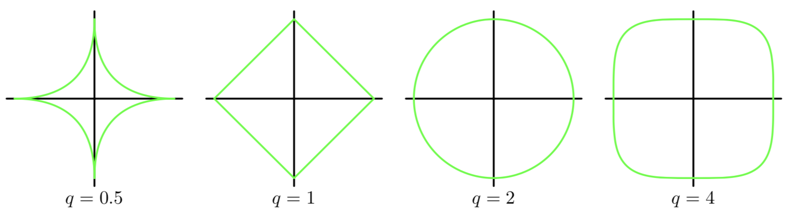
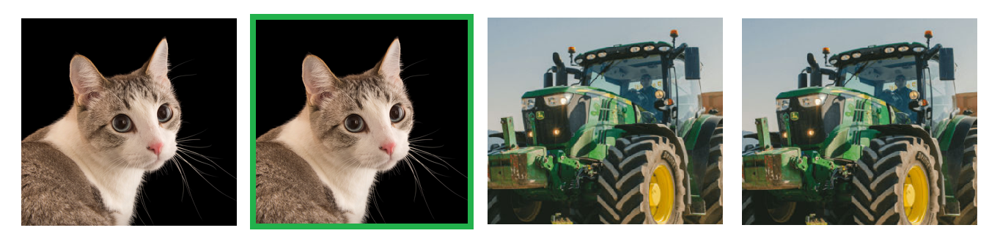
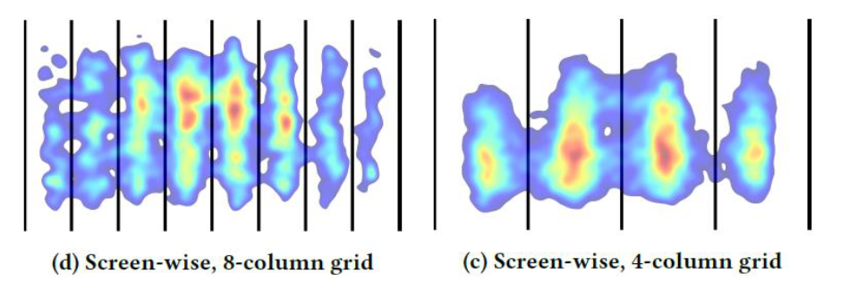

<!-- omit in toc -->
# Vyhledávání ve videu (NDBI045)

poslední update: 22. 5. 2024

:warning: - na tohle bacha

:question: - tady moc netušim, co se děje, je potřeba doplnit

<!-- omit in toc -->
# Obsah

- [Video formáty, základ](#video-formáty-základ)
- [Ukládání a sdílení multimédií](#ukládání-a-sdílení-multimédií)
- [Similarity search](#similarity-search)
- [Global Image Descriptor](#global-image-descriptor)
- [2012 game changer](#2012-game-changer)
- [Local Image Descriptors](#local-image-descriptors)
- [Střihy ve videu](#střihy-ve-videu)
- [od roku 2012](#od-roku-2012)
- [Základy neuronových sítí](#základy-neuronových-sítí)
- [Multi-modal search](#multi-modal-search)
- [Temporal query](#temporal-query)
- [Interactive search](#interactive-search)
- [Vizualizace](#vizualizace)

# Video formáty, základ

## Analog → digital

- digitální video - posloupnost obrázků
- zvuk - příčné kmitání vzduchu
- analogové signály $\rightarrow$ je potřeba je diskretizovat samplováním (a diskretizovat samply)

### Kvantizace

- kolik hodnot je potřeba pro reprezentaci
- diskretizace oboru hodnot signálu, je to **ztrátový a nevratný** proces
- bitová hloubka - počet bitů pro reprezentaci jedné nasamplované hodnoty (třeba jednoho pixelu videa)
  - $n$-bitový systém má $2^n$ kvantizačních levelů (q-levels, aka kolik máme chlívků, kam hodnoty padají)
  - *quantization error* ("kvantizační chyba") - rozdíl mezi opravdovou naměřenou hodnotou a nejbližší diskrétní hodnotou, kam je naměřená přiřazená

### Samplování

- jak často je potřeba pořídit záznam analogového světa?
- nízké samplování vede ke ztrátě kvality dat
- čím častěji, tím lepší kvalita, ale zároveň vyšší spotřeba paměti

#### Jak samplovat správně?

- alespoň 2krát tak vysoká frekvence samplování jako nejmenší frekvence, kterou chci sledovat (u hudby 44 kHz, zdravý člověk slyší 20-20.000 kHz)

### Aliasing

- chyba při samplování

- hodiny jsou snímané po 50 minutách a vypadá, jako kdyby se ručička točila protisměru
- dá se mu částečně zabránit viz [jak samplovat správně](#jak-samplovat-správně)

### Kvantizační chyba

- **falešné hrany**
  - pokud je dělení příliš hrubé, dochází ke vzniku falešných hran
  - hrany jsou způsobeny nedostatkem informace (neexistují jemné přechody)
- **kvantizační šum**
  - nepřesnosti
  - skoky mezi barvami a jasem, zejména na místech plynulých přechodů

  
  

## Kvantování vs vzorkování

- nemáme-li dostatek prostoru na uložení souboru a musíme se rozhodovat, kde ho ušetříme:
  - obrázek s detaily - jemné samplování, hrubé kvantování
  - obrázek s věrnými barvami - jemné kvantování, hrubé samplování

# Ukládání a sdílení multimédií

- **multi**medium $\rightarrow$ sposuta částí
- balí se do tzv. *container*ů
  - soboury ve kontejneru jsou kompriovaná, ale kontejner $\not =$ komprese
- míra komprese se dá měřit
- **bit rate** - množství dat použito na reprezentaci média za časový úsek

## CoDec

- **coder, decoder** - komprese/dekomprese
- decoder vezme sekvenci bitů a vytvoří z nich bitmapy, které se pošlou na zobrazovací zařízení, coder dělá přesný opak
- populární formáty: H.264, H.265
- **frame rate** - počet bitmap za sekundu (pro lidské oko stačí 24-30 fps)

## De/Muxing

- **muxing** - kombinování několika singálů a datových streamů do jednoho multiplexed data streamu
- **demuxing** - rozsekání multiplexed data streamu na jednotlivé signály, streamy
  - každý komponent může být zpracováván zvlášť

## Typický postup

1) komprese:
  - video se zkomprimuje pomocí algoritmu, stadardně H.264 (AVC) nebo H.265 (HEVC)
  - komprese sníží velikost videa, ovšem zachová nejdůležitější aspekty kvality
  - video se po kompresi lépe posílá po síti, streamuje
2) multiplexing:
  - po kompresi se video zkombinuje s ostatními signály/streamy - audio, titulky, metadata, do jednoho kontejneru
  - výsledkem je soubor, který obsahuje vše potřebné (třeba MP4, MKV)

## Kontejnery

- :warning: tato kapitola trpí nedostatky i nejasnostmi

- kontejner se dělí na boxy/atomy
  - základní jednotka
  - má typ a velikost
  - otevřený
  - rozšiřitelný

### MP4

- ISO/EIC, standardizováno
- dá se s ním dělat všechno: záznam, editing, přehrávání, streamování
- části:
  - `ftyp` - file type
  - `mdat` - media data
    - tady jsou ta opravdová data
    - odkazuje na ně moov
  - `moov` - movie atom
    - metadata - dekódovací info
      - :warning: je až na konci!
    - informace o struktuře - tracks, timing ...

- úplně primitivně se v něm dá hledat pomocí metadat:
  - autor, datum a čas pořízení, titulky (musí být správně synchronizované)

- z dodatků, kterým ale skoro nikdo nerozumí:
  - na 1 sekundu máme 30 videosamplů a 40k audiosamplů - to je potřeba o timestampovat, aby bylo jasné, co k čmeu patří

#### `track` - Track Atom :question:

- reprezentuje jedno médium (video, audio, titulky, ...)
- `stbl` - sample table atom
  - drží informace o samplování dat a časování medií :question:
  - :question: bordel
  - `stsd` - jaký použít kodek
  - `stts` - časové razítko, přiřazuje sampl :question:
  - `stsc` - samplu přiřadí čas :question:
  - `stco` - offset chunku, aby bylo jasné, kde v paměti se nachází

- časová razítka
  - oddělená pro audio/video (nebo spolu, pak hledáme nejmenší společný násobek :question:)

## Komprese videa

- komprese je ztrátová
- $f_{\text{DEC}}(f_{\text{CO}}(\text{frame})) = \text{frame}$?
- to nutně neplatí, ovšem výsledek se bude hodně blížit původnímu snímku
- lidé nejsou dokonalí, tak si můžeme dovolit samplovat video 30 fps a neřešit $\rightarrow$ redundance, té lze využít v kompresi videa
- kvantizace frekvenčních domén (q-levels) $\rightarrow$ jpeg

### Coding units and partitions

- snímky od sebe lze odečítat, abychom detekovali stejné. ve videu to ovšem nelze, protože se snímky za sebou nejsou vždy **úplně stejné**, přestože se tak mohou jevit
- je potřeba rozdělit si snímek na menší části (většinou čtverce, někdy obdélníky) a řešit v každém zvlášť

- AVC - makrobloky, čtverce $16 \times 16$
- HEVC - sofistikovanější
- **coding quad tree**
  - rekurzivní rozdělení snímku na menší a menší oblasti
  - největší $64 \times 64$ px, nejmenší $4 \times 4$ px
  - čím větší detail, tím menší čtverec
  - čtverce, které jsou stejné jako v předchozím snímku teoreticky můžeme zkopírovat (a ušetřit tak paměť)
  
  

### INTRA picture prediction, vnitřní

- na základě souvislostí mezi již vytvořenými pixely hádá hodnotu dalšího pixelu
- video editing SW chtějí intra-frame-only kódování (mjpeg)
- predikce na základě směru pixelů; AVC má 9, HVEC 30

#### JPEG-like přístup

- RBG $\rightarrow$ YCbCr $\rightarrow$ Chroma subsampling $\rightarrow$ F-Domain $\rightarrow$ kvantizace $\rightarrow$ entropy encoding
- **YCbCr**
  - Y, luminance - celkový jas/intenzita každého jednoho pixelu
  - Cb, chrominance blue - odchylka barvy od šedé na modré ose, pozice barvy mezi modrou a žlutou
  - Cr, chrominance red - odchylka barva od šedé na červené ose, pozice barvy mezi červenou a cyan
- **entropy coding**
  - komprese dat
  - časté symboly jsou reprezentovány co nejkratšími *codes*
  - méně časté symboly jsou reprezentovány delšími *codes*
  - třeba pomocí Huffmana

### INTER picture prediction, vnější

- předpověď na základě předchozích snímků, snaží se najít podobný vzor/čtverec a ten použít k rekonstrukci sebe sama. tím výrazně šetří paměť

#### Odhad pohybu (motion estimation):

- předpověď pohybu pixelů/čtverců a následná kompenzace tohoto pohybu
- Pokud je algoritmus úspěšný a najde podobný blok v referenčním snímku, pak je současný blok zakódován jako vektor pohybu. Ten ukazuje na blok v referenčním snímku.
- nalezený blok se často neshoduje úplně, encoder spočte jejich rozdíl (jak :question:). tomu se říká **residual** nebo taky *prediction error*, s touto chybou poté :question: nějak pracuje i decoder
- TLDR: encoder (jeho prediction unit) najde podobné dva bloky -> spočte jejich motion vector (který ukazuje na referenční blok) a prediction error (residual) -> decoder umí z těchto informací dostat raw pixel data pro rekonstrukci obrazu

- musí platit: $c(\text{motion info}) + c(\text{residual}) < c(\text{original})$
  - že vektor s informací o pohybu + informace o chybě (aka to, co spočte ten encoder) je na bity menší než raw informace
  - když nám algoritmus spočítá super referenci z předchozího snímku, ale zakóduje ji tak, že je větší než raw nezměněná informace, tak je to k ničemu
  - (tohle je důležitý z prezentace, ale abych zjistil, co to znamená, tak jsem musel přečíst celou wiki, lol)
  - přesnost v sub-pixelech, obvykle 1/4, 1/2
    - to hodně zjednodušeně znamená: Pracujeme ve vyšším rozlišení, než ve kterém je původní obrázek, a to tak, že si doplníme chybějící pixely pomocí průměrování ostatních okolo. Víc na [StackExchange](https://dsp.stackexchange.com/questions/34103/subpixel-what-is-it).

#### GoP - Group of Pictures

- existuje několik typů snímků:
  - **I** - intra frame, zakódováný pouze se referencemi na sebe sama, používá se jako spolehlivá reference pro snímky, které jsou závislé na ostatních 
  - **P** - forward predicted, predikován na základě dřívějšího obrázku
  - **B** - bidirectionaly predicted, predikován na základě přechozího a/nebo pozdějšího obrázku (většinou nejsou používány jako reference pro predikci jiných snímků, aby se zamezilo šíření chyb)

- Stadarně GoP vypadá jako `IBBPBBI...`. Kde se nejdříve vytvoří **P** z **I** a následně se mezi ně a podle nich vytvoří dva **B** snímky.

#### Plusy a mínusy:

- Super je, že struktura je efektivní na spotřebovanou paměť. ALE! snímky se nevyrábí chronologicky, je někde potřeba držet **P** snímek, než vyrobíme a pošleme dva **B** snímky.
- velmi efektivně snižuje velikost uložených dat, ukládají se pouze změny ve snímcích
- Snímky jsou na sobě navzájem závislé, to může způsobit problémy při přenosu po síti. Zároveň chyba z jednoho odhadu propagovat skrz sérii snímků a postupně se zhoršovat.
- právě kvůli propagaci chyb se používá I-frame, který intra coded, tedy vždy může být dekódován bez závislosti na ostatních. je to takový pevný bod ve změti předpovědí. kdyby se náhodou něco pokazilo, tak tohle je odrazový můstek pro nový start bez chyb.

### Možná vylepšení

- časově hodně náročné, mohou pomoct heuristiky
- rozdělovat reference mezi obrázky na menší bloky (pak se mohou zpracovávat paralelně, protože na sobě navzájem nesouvisí)
- filtry, které odstraní artefakty komprese

## Komprese audia

- podobně jako pro video encoding a decoding nutně nedává stejná výsledek jako na začátku
- input: 16/32 bits samplování nejčastěji 48kHz
- nejčastější standardní komprese:
  - MP3 - revoluce pro web
  - AAC - následník MP3, mnohem lepší pro nízký bitrate, používá jej Apple a Android
- encoderu se nachází část *Psychoacoustic model*, kterou lze konfigurovat podle reálných sluchových schopností člověka - neuvažovat vysoké/nízké frekvence, maskování, ... Nastavení je možné měnit dynamicky.

- **maskování**
  - jeden zvuk výrazně zhoršuje vnímání jiného zvuku
  - maskování je způsobeno nedokonalostí lidského sluchového aparátu

# Similarity search

- různé přístupy k reprezentaci videa k vyhledávání:
  - video - všechny snímky
  - shots - záběry ve videu
  - representative frames - jeden reprezentativní snímek z každého videa/záběru
  
- motivace pro různé přístupy:
  - některé databáze jsou příliš velké, i ty osobní
  - požadavky uživatele mohou být různé
  - s interkativním přístupem/ovládáním často stačí používat frame based search

- Similarity models, Leška, Veselý 2023  

## Různé druhy hledání

- ↑ meta-data based search ↑
- hledání podle atributů (jsou potřeba atributy)
- hledání podle klíčových slov (je potřeba anotování klíčovými slovy)
- hledání podle textového dotazu (je potřeba znalost jazyka, kterým se hledá)
- hledání podle náčrtku (potřeba umět kreslit)
- hledání podle příkladu (je potřeba mít příklad)
- ↓ content based search ↓

## Reprezentace podobnosti pomocí vektorů

- získání featur, **funkce**, která každému obrázku z databáze $DB$ přiřadí $D$-dimenzionální vektor:
  
$$f_e : DB \rightarrow U_D$$

- vzdálenost dvou vektorů featur (jak moc jsou si featury podobné), funkce, která každé dvojici vektorů přiřadí nějaké kladné reálné číslo:

$$\delta : U_D \times U_D \rightarrow \mathbb{R}_0^+$$

- chtěli bychom, aby platili alespoň nějaké vlastnosti metriky:
  - $\forall x, y \in U:$
    - $\delta(x, y) \geq 0$
    - $\delta(x, x) = 0$
    - $\delta(x, y) = \delta(y, x)$
  
- similarity score pro dva obrázky $A$ a $B$ dostaneme jako:

$$\delta(f_e(A), f_e(B))$$

## Funkce vzdálenosti

### Cosinová

$$1 - \frac{x \cdot y}{\|x\| \, \|y\|}$$

(ta jednička tam je kvůli tomu, aby funkce byl nezáporná)

### $L_p$ norma

$$\sqrt[p]{\sum_{i=1}^n w_i {|x_i - y_i|}^p}$$

- kde $\mathbf{w}$ je vektor vah
- $p$ je standardně: 1 (Manhattan), 2 (Euklidovská vzdálenost), 3 ...
- pokud $p = \infty$, pak je jednotková kružnice čtverec

### Jaccardův index

$$1 - \frac{|X \cap Y|}{|X \cup Y|}$$

- je potřeba, aby obrázky byly předem nějak otagované. vlastně to znamená "1 - počet sdílených vlastností / počet vlastností dohromady", případně "1 - overlap / společná plocha"

  
  

## Použití vzdáleností při dotazování

### Range query

- vrať všechny objekty v databázi $O: \forall o \in O \; d(o, q) < r$, kde $q$ je dotaz a $r$ je poloměr hledání

### kNN (k Nearest Neighbors)

- vrarť $k$ nejbližších objektů k dorazu $q$ (`argsort`)

# Global Image Descriptor

## Histogramy

- třeba pomocí histogramů, to je 256 hodnot na jednu barvu, to je dost
- jde zlepšit pomocí řazení pixelů do chlívků (nerozlišujeme 256 barev v kanálu, ale třeba jen 8)
  - **hard assignment** - pixel padá do jednoho chlívku
  - 
  - **soft assignment** - pixel padá do více chlívků 
  - 
- další možné úpravy:
  - škálování obrázku
  - hrubší q-levels (počet chlívků pro jeden kanál)
  - zpracování pouze nějaké části obrázku (třeba kolečka ve středu)

- další možnosti:
  - konkatenace histogramu ($3 \times 256$)
  - n-dimenzionální reprezentace barevnosti (třeba s q-levels 8,  $8\times 8\times 8$)
  - k-means, načíst víc o tom

- informace o pozici
  - histogramy pro různé části obrázku, přibude $x,y$ dimenze

- histogramy lze vytvářet také pro video
  - lze sloučit features více snímků do jednoho histogramu
  - nebo sloučit více histogramů ze snímků do jednoho vektoru

# 2012 game changer

## AlexNET

- CNN - Convolutional Neural Network - neuronová síť
- podporuje 4096 tříd

### Jak to funguje?

- nahraje se obrázek (3 vrstvy, RGB)
- aplikuje se **konvoluční filtr** ($n \times m$), který skáče po $k$ pixelech z toho máme nový vektor
- takových filtrů se aplikuje několik
- aplikuje se **pooling**
  - snižuje dimenze (down sampluje) nově získané features
  - díky tomu je model odolný vůči posunu
- znova se aplikují konvoluční filtry
- znova pooling
- ...
- vektor se postupně prodlužuje a jeho průřez se zmenšuje
- na konci máme opravdu dlouhý vektor, aplikujeme na něj softmax a máme předpovězeno

- filtr:

- nebo si to můžeme představit jako propagaci skrz neuronovou síť, kde jsou filtry

- [pěkné video od IBM](https://youtu.be/QzY57FaENXg?si=Yt_DchGlB4D5XDpx)

### Trénování

- filtry mají váhy, ty se dají trénovat, v tom spočívá užitečnost CNN
- podobně jako třeba u MLP (multi-layer perceptron) je model schopen pomocí základních stavebních bloků reprezentovat složitější struktury v hlubších vrstvách sítě

# Local Image Descriptors

- globální hledání není vhodné prp všechny tasky
- občas prostě chceme najít něco ve scéne a ne scénu, nebo třeba trackovat předmět mezi snímky
- takový model musí být robustní:
  - odolávat změnám nasvícení a zabarvení atd., třeba a i částečnímu zakrytí předmětu
  - nesmí ho zmást škálování, otočení ani posunutí obrázku
  
## SIFT - Scale-Invariant Feature Transform

- velmi populární před DL
- unsupervised
- robustní detekce a popis klíčových bodů

### Jak to cca funguje?

- každý obrázek je popsaný lokálními deskriptory ($v_i \in \mathbb{R}^{128}$)
- $v_i$ popisuje obsah vybraného subobrázku kolem detekovaného klíčového bodu
  - klíčový bod a prostor kolem něj jsou odolné vůči škálování, rotaci a změně úhlu pohledu, šumu, osvětlení ...
  - takové body jsou většinou hranice objektů (prostě významné edges)
  - zároveň je důležité, že jsou body vůči sobě stále stejně relativně umístěny
  - obecně má problém s předměty, které mezi snímky mění tvar (špatně snáší změny geometrie); v praxi se používá tolik bodů, že se takovéto chyby eliminují
- právě proto, že odolává většině možných transformací, je schopen detekovat i částečně zakryté objekty
- podobnost obrázků lze zjistit párováním popiaovač jednoho na popisovače druhého, problémem je, že je to časově náročné

#### Výroba klíčových bodů

- [všechno lépe tu](https://homepages.inf.ed.ac.uk/rbf/CVonline/LOCAL_COPIES/AV0405/MURRAY/SIFT.html)

1) *scale space extrema* - tipovačka s Gaussovskou, jaké body by mohly být významné (složitá matika)
2) vyřazení bodů s nízkým kontrastem
3) vyfiltrování bodů, které se nachází na hraně, ovšem nachází se tam v dost nešťastné pozici

4) každému bodu se přiřadí jedna nebo více orientací na základě lokálních gradientů (invariance vůči rotaci)

### Jak reprezentovat klíčový bod

- klíčovému bodu se přiřadí vektor orientace (orientací)
- teď chceme pro bod spočítat *descriptor vector*
- spočteme pro něj orientované histogramy (s q-levels = 8)
- (s těmi se pak dál pracuje, ale to je (snad) mimo scope předmětu)
- *descriptor* je pak vektor všech těchto histogramů (shape vektoru je $(128,)$), vektor ještě normalizujeme
- pak se aplikuje nějaký (empiricky zvolený) threshold a znova se normalizuje

:question: tady se ztrácim af

### Jak to na sebe matchovat

- pro větší databáze je potřeba obrázky v databázi rozumně indexovat (předtřízení, rychlé vyhledávání ...)
- může se dost dobře stát že hledaný objekt je v obrázku trochu posunutý, otočený ..., je potřeba počítat i s tím. klíčové body na sebe můžeme namatchovat, jestliže existuje řešení rovnice:

$$\left(\begin{array}{}
  x & y & 0 & 0 & 1 & 0 \\
  0 & 0 & x & y & 1 & 0 \\
  &&\vdots &&&
\end{array}\right)
\left(
  \begin{array}{}
    m_1 \\
    m_2 \\
    m_3 \\
    m_4 \\
    t_x \\
    t_y
  \end{array}
\right) =
\left(
  \begin{array}{}
    u \\
    v \\
    \vdots
  \end{array}
\right)
$$

- samozřejmě se může stát, že transformace aplikované na objekt nejsou lineární. proto je potřeba nechat matchování nějakou wigle room. odchylky předpokládanýych bodů spočteme jako eukliodvskou vzdálenost a omezíme ji nějakým číslem zeshora.

- na výpočet se používá výborná věc z Lineární algebry I a II:

$$
\begin{align*}
  A\mathbf{\hat{x}} &\approx\mathbf{b} \\
  A^TA\mathbf{\hat{x}} &= A^T\mathbf{b} \\
  \mathbf{\hat{x}} &= (A^TA)^{-1}A^T\mathbf{b}
\end{align*}
$$

### Použití

- object recognition
- image alignment
- panorama stitching

# Střihy ve videu

- hard/soft cuts, šum v datech, neurčitost

- tradiční přístup:
  - podle podobnosti snímků za sebou (lze měnit threshold)
  - trackování objektů/klíčových oblastí ve videu
  - machine learning s použitím ručně vytvořených featur
- end-to-end DL přístup (end-to-end = pustim to a neřešim nic):
  - 3D konvoluční sítě

- hodnocení modelu podle accuracy, precision a recall

$$\begin{align*}
  P &= \frac{TP}{TP + FP} \\
  R &= \frac{TP}{TP + FN} \\
  F_\beta &= \frac{(1 + \beta) TP}{(1 + \beta)TP + FP + \beta^2 FN} \\
  \implies F_1 &= \frac{2TP}{2TP + FP + FN}
\end{align*}$$

# od roku 2012

- DL a CNN dominují analýzu videa/audia (deep learning, convolutional neural networks)
- rychlé, efektivní a poměrně spolehlivé řešení usnaďnují použití v průmyslu (dnes jsou nejčastějšími aplikacemi: object detection, image classsification, object classification, semantic segmentation)

# Základy neuronových sítí

- cílem je klasifikovat co nejvíce příkladů správně
- AlexNet kombinuje několik základních stavebních bloků:
  - hustá/FC (fully connected) vrstva:
    - má |input| $\times$ |output| vah
    - softmax (nebo jiná podobná funkce) na poslední vrstvě
  - konvoluční vrstva pro filtr (idk, českej překlad je fakt divnej)
    - rozlišení filtru je $m \times n$
    - váhy filtrů jsou sdílené s *neuron grid* :question:
    - často $2^k$ filtrů $\rightarrow 2^k$ kanálů
  - spatial pooling
    - redukce rozlišení (aby ten vektor nebyl velkej jak debil)
    - často zmenšení o jednu polovinu
    - často maximální hodnota nebo průměrná okolí, co se zrovna redukuje
    - output je jaksi zmenšení obrázek
  
## Image classification

- přiřadí celému obrázku jednu z podporovaných tříd
- revoluce v roce 2015: ResNET
  - velkou změnou je, že se výsledky vrstev propagují i dále než do první následující
  - po odstranění poslední vrstvy (která mapuje spočtené vektory na naučené třídy) se dá output použít pro similarity search

## ResNET

- *residual connection*
  - výstup vrstvy je použit jako vstup o několik vrstev v budoucnosti
  - zásadně boří představu o sítích z předešlých let (že výstup jedné vrstvy je vstupem další)
- vyšší desítky vrstev

TODO: jak funguje ResNET

## Object detection

- k úspěšnému řešení potřebujeme classy najít a otagovat je pomocí bboxů

### Kde ty classy jsou?

- zkoušet různě velká okýnka po celém obrázku a postupně klasifikovat
  - to je časově naprosto šílený
- hledat v chytře ručně vytyčených částech obrázku
  - stále dost náročné
- region proposal network + shared feature maps
  - RPN je neuronová síť, která umí navrhovat, kde se na obrázku nacházejí nějaké objekty a jak moc to jsou objekty
- RPN lze plně integrovat do CNN a mít tak end-to-end model
- případně můžeme CNN natvrdo říct, kam chceme, aby se díval při předpovědích :question:

### R-CNN - region proposals with CNN

- RPN navrhne místa na prozkoumání a pak je pošle do CNN, které je klasifikuje

### Datasety

#### ImageNet

- obrázky pro slova uspořádaná ve WordNet hiearchii
  - WordNet - hiearchii, kde na každém levelu synonymum :question:

- 14 milionů obrázků
  
#### COCO dataset

- 330 000 obrázků
- 1,5 milionu objektů (aka bboxy s classou)
- 80 kategorií

## Neuronové sítě TLDR

- neuronová síť je skoro funkce (pokud je deterministická :question:)
- mnoho hyperparametrů
- základem je trénování a velkou výhodou snadná rozšiřitelnost
- aproximuje funkce pomocí velké armády neuronů
- průlom v roce 2012 s AlexNET
  - konvoluční masky, FC vrstvy na konci
- ResNET
  - vyšší desítky, nižší stovky konvolučních vrstev
  - *residual connection* - přeskakování vrstev
- klasifikace objektů v obrázku pomocí R-CNN
  - predikce **R**egionů, návrhy oblasatí na prozkoumání pro CNN
- YOLO se obejde bez regionů :question: (idk, píšu na to bakalářku a nevim, lol)

# Multi-modal search

- pro similiar hledání můžeme modalitu $M$ formalizovat jako $(\delta _M, f_{eM})$
  - aka modalita je fce extrakce a vzdálenosti
- pak vyhledávací systém/algoritmus spočítá vzdálenosti mezi dotazem a všemi objekty v databázia seřadí je
  - vhodné modality: :question: dost random sekce
    - rgb histogram:
      - den/noc
      - detekce střihu
      - rozhodně neumí rozlišovat objekty
  - jak hodnotit modality?
    - precision = # relevantních / velikost výsledku, TP / (TP + FP)
    - recall = TP / (TP + FN)
      - kolik hledaných objektů ze všech objektů najdu
    - precision jako funkce recall nám dávat odhad toho, kolik výsledků musíme zobrazit, abychom viděli $x$ \% chtěných výsledků
- pro velké datasety je potřeba data rozumně indexovat, abychom mohli hledat v reálném čase

- videodata maj tu skvělou výhodu, že je tam spousta modalit, které se dají použít pro třízení:
  - kanály barev
  - hrany a tvary
  - semantické koncepty
  - zvuk, řeč
  - atributy jako třeba titulky

## Late fusion vs. early fusion

- **late fusion**
  - všechny modality se učí zvlášť a spojují se těsně předtím, než model učiní predikci
  - více modelů -> více predikcí -> finální predikce
- **early fusion**
  - všechno modality se propojí a až pak se trénuje model
  - více algoritmů v jednom modelu -> jedna predikce -> finální predikce

## Mono vs. Multi-modal

- hledání nejbližších výsledků podle jednoho/více feature deskriptorů

# Temporal query

- spočívá v tom, že něco hledám a vím, co následuje ve videu po tom
- třeba "kočka" a hned po ní je "traktor"
- sekvence snímků vypadá nějak takto:

- pro každý snímek máme skóre, jak moc je kočka ($Q_1$) a jak moc je traktor ($Q_2$)
- z toho můžeme spočítat skóre dvojice snímků, které jsou za sebou jako $Q_1[i] \times Q_2[i+1]$

$$
\def\green#1{\colorbox{green}{#1}}
\begin{array}{l | l l l l l l l l l}
  Q_1                    & \ldots & 0.1 & \green{0.1} & 0.8 & 0.9 & \ldots \\ \hline
  Q_2                    & \ldots & 0.8 & 0.9 & \green{0.1} & 0.1 & \ldots \\ \hline
  Q_1[i] \times Q_2[i+1] & \ldots & 0.09 & \green{0.01} & 0.08 & \ldots & \ldots
\end{array}
$$

- *temporal context* je parametrem vyhledávání, je to offset od prvního po druhý obrázek (v příkladu $+1$)

- v současnoti se nejvíce vyvíjí *joint embedding learning*
- formalizované jako: $\delta(f_{eq}(\text{query}), f_{ed}(\text{data}))$
- reprezentuje data z různých modalit v prostoru featur

### Clf based vs Joint embedding based search

- classification based search:
  - z textu dotaazu se použijí pouze jjména naučených tříd, search engine rankuje obrázk podle skóre jednotlivých hledaných tříd
- joint embedding based search
  - reprezentace dat pomocí více modalit ve sdíleném prostoru featur
- contrastive loss vs triplet loss to train model
  - constrastive:
    - podobná data jsou u sebe, různá jsou od sebe naopak co nejdále
    - díky tomu zachycuje semantický význam
    - použití mimojiné ve zpracování přirozeného jazyka
    - použivá se v downstreak věcech (kde ouptut závisí na předchozím outputu)
  - triplet loss:
    - snaží se minimalizovat vzdálenost podobných dat
    - oproti constrastive funguje v trojicích dat:
      - anchor (kotva)
      - kladný příklad vzhledem k anchor
      - záporný příklad vzhledem k anchor
      - cílem je mít kladný příklad co nejblíže a záporný co nejdále
    - umí semantický význam, podobnosti a rozdíly mezi daty

## CLIP

[Computerphile video o CLIPu](https://youtu.be/KcSXcpluDe4?si=puPNNKshk46Wk2Jq)

- contrastive language image pairs
- jeden z přístupů je naučit model na dvojicích popis + obrázek. Pokud model natrénujeme na 1000 třídách, pak umí rozeznat 1000 tříd. kdybychom chtěli nějakou třídu přidat, je potřeba vytvořit nová data a **celý** model trénovat znovu.
- možné vylepšení je popis obrázku pomocí *caption*, ovšem problém s přidáváním tříd zůstává
- cílem je najít řešení tohoto problému. třeba tak, že umíme text a obrázky převést do stejného feature prostoru

- trénován na 400 mil image caption pairs (dnes cca 5 miliard), stahování dat pomocí web scraperů a crawlerů
- v takovém množství přestává být class clf nepoužitelná
- obrázek jede skrz *vision transformer*, který se ho přetransformuje do embeddingu
- text jde do *text transformeru*, který ho hodí do embeddingu
- cílem je natrénovat ViT a TeT tak, aby pro páry dávali co nejpodobnější embeddingy

### Jak to trénovat?

- vezmeme batch
- matice $n \times n$
- spočteme vzdálenost mezi všemi texty a obrázky v batchi
- cílem je na $i,i$ (diagonále) mít co nejmenší číslo a na ostatních místech co největší, pro vzdálenost se používá cosinová vzdálenost 

  
### Použití

- vezmu text, narvu ho do TeT a dostanu embedding textu
- umí zero-shot clf (klasifikuje obrázky, přestože je nikdy neviděl)
  - ViT a TeT fungují pouze v jednom směru (nelze vzít text embedding a dostat z něj text)
  - classy, které chceme rozlišit si zapíšeme a pak je embeddujeme (máme databázi embeddingu class)
  - proženeme obrázek skrz ViT a k výsledku najdeme co nejbližší class embedding
  - díky tomu je CLIP snadno rozšiřitelný (přestože ne moc efektivně, je to stále lepší ne neustále trénovat nové modely)

### Výhody

- robustní pro různá data
  - výborně abstrahuje, rozšiřitelnost

# Interactive search

- vyhledávání je pro uživatele
- musí být responzivní (dost rychlé)
- díky interakci s uživatelem máme několik informací navíc:
  - feedback ohledně relevantnosti výsledků a dotazu
  - dobrá vizualizace může pomoci s orientováním se ve větším množství dat
  - pro některé dotazy je potřeba jakože fakt vyhledávat, klidně í víckrát, v databázi
- vyhodnotit, jaká UI funguje a jaká ne, je dost náročné
- model je updatován na základě obrázků vybraných uživatelem
- relevance feedback loop:
  - univerzální přístup
  - vrátim modelu +/- obrázky, které chci/nechci

## Feedback

- lze použít na:
  - update dotazového vektoru (Rocchio algortimus)
  - update modelu (učení se, update vah)
  - update ohodnocení všech současných dat (třeba pomocí Bayes frameworku)
  
### Rocchio algoritmus

- předpokládá, že data jsou reprezentována jako vektory. přičítá a odčítá chtěné/nechtěné vektory, teoreticky nás pošoupne tam, kde chceme být

- $D_R$ jsou relevantní výsledky podle uživatele a $D_N$ irelevantní

$$
Q_{new} =
\alpha Q_{old}
+ \frac{\beta}{|D_R|} \sum_{\mathbf{v} \in D_R}\mathbf{v}
- \frac{\gamma}{|D_N|} \sum_{\mathbf{v} \in D_N}\mathbf{v}
$$

- kde $\alpha, \beta, \gamma$ jsou váhy

### Bayes update

:question: wtf

- ukážeme uživateli náhodný obrázek/obrázky podle textového vyhledávání
- uživatel vybere nejlepší obrázek (ten máme v historii hledání)
  - více iterací algoritmu $\rightarrow$ větší historie

- update hledání:
  - $P$(pravděpodobnost, že hledaný obrázek je aktuálně zobrazen | dotaz, display, historie)

- v čem je to dobrý?
  - můžeme uživateli nabídnout i obrázky, které neskórovaly vysoko, abychom se ujistili, že hledáme dobře
  - chceme na uživateli otestovat co nejvzdálenější obrázky (těm, co si myslíme, že hledá), abychom mohli zamítnout co největší počet možností

# Vizualizace

- člověk má omezené možnosti vnímání, proto je potřeba mu informace předkládat v co nejsrozumitelnější a zároveň nejefektivnější formě

- je potřeba zvážit:
  - kolik obrázků na jedné stránce je uživatel schopen zpracovat?
  - jak dlouho je ochoten čekat, než se na to vykašle

- různé úlohy si vyžadují různé přístupy
  - co hledáme?
  - jak to hledáme?
  - jak bychom databázi popsali?

- Gestalt laws

- nápady na rozložení gridu výsledků, mapování obrázků do gridu podle ranku:

- při hledání na webu se uživatel nejčastěji dívá do levého horního rohu, pokud ale vyhledávají obrázek, koukají doprostřed

- kam se uživatel reálně dívá?

- pokud je obrázků příliš, může pomoci nějaká algoritmická reorganizace top nalezených shod podle jiných dalších atributů
- obecný nápad:
  - prohazujeme obrázky, dokud to zlepšuje skóre (musíme nadefinovat nnějakou funkci, co chceme zlepšovat)
  - chceme podobné u sebe

- nechť $\Omega$ je set dat, kde pro každé dva objekty umíme spočítat *dissimilarity* $\delta$("rozdílnost"), ta je skoro-metrika. cílem je každému objektu $i$ přiřadit vlastní chlívek $L_i$, tak aby se maximalizovala funkce

$$
\argmax_L \sum_{\forall i,j \in \Omega} \frac{(\|P(L_s) - P(L_t)\| - \bar{P})(\delta(s,t) - \bar{\delta})}{\sigma_P \sigma_\delta}
$$

- kde:
  - $P(x)$ je umístění chlívku v gridu ()
  - $\sigma_P$ a $\sigma_\delta$ jsou směrodatné odchylky
- aka počítáme (vzdálenost dvou chlívků - průměr) $\times$ (vzdálenost obrázků - průměr) / (odchylky)

[Data Organization and Visualization using Self-Sorting Map, str. 1-2](https://dl.acm.org/doi/pdf/10.5555/1992917.1992950), fakt mega hustej paper, přísahám

## SSMs (Self-sorting Maps)
- klasické metody třídění čísel se nedají jednoduše rozšířit na třízení obecných objektů (třeba barviček)
- nejsou tak efektivní, zato jsou univerzální
- třídí se podle předem definované funkce vzdálenosti, $\delta(i,j)$

### Třízení v 1D

#### 1D objekty

- v 1D je to takovej retardovanej merge sort

#### Více dimenzionální objekty

- :warning: stále třídíme v 1D array do 1D arraye, objekty mají více dimenzí
- vícedimenzionální data (jako třeba RGB barvy) se nedají rozumně třídit
  - kdyby se to dělalo nejdřív podle R, pak podle G, pak podle B, tak nemáme zaručeno, že dvě podobné barvy (podle lidského úsudku, podobnost může být cokoliv, co si zadefinujeme, že) skončí vedle sebe
- nestačí jen se zeptat $s > t$ pro dva objekty
  - porovnání je založeno na tom, jestli prohození může snížit rozdíl vzdáleností mezi dvěma objekty a jejich sousedy
  - objekty si náhodně promixujeme a rozdělíme do $k$ stejně velkých bloků $B_1, B_2, ..., B_k$
  - aby se to dalo dělat rozumně, spočteme si *target vector* $T_i$ pro každý blok $B_i$ jako:

$$
T_i = \sum_{k=-1}^{+1} \text{Gauss}(k) \frac{\sum_{s \in B_{t+k}} s}{|B_{i+k}|}
$$

- kde $\text{Gauss}(\cdot)$ je normalizovaná Gaussova funkce a $B_i$ je počet objektů v $B_i$

- čili je to gaussovkou přenásobený průměr bloku samotného + průměr bloku nad a pod, tohle je kvůli tomu, aby přechody nebyly tak ostré a lépe to vypadadlo (-> kdyby target vektor byl jenom přes jeden blok, byly by ty přechody ostřejší :question:)
- objekty prohazujeme stejně jako v 1D příkladu, dva objekty $s,t$ **ze dvou sousedních bloků** $B_i, B_{i+1}$ se prohodí, pokud minimalizují funkci:

$$
\argmin_{(s,t)} (\|s - T_i\| + \|t - T_{i+1}\|)
$$

- kde $\|a-b\|$ je (třeba :question:) euklidovská vzdálenost vektorů $a,b$
- tento test se provede pro všechny dvojice, pro nové rozložení objektů v blocích se spočítají nové target vektory
- to se opakuje, dokud výpočet nekonverguje (nedojde k žádnému prohození)
- (podobá se k-means algoritmu, akorát tohle hejbe data mezi bloky o fixní velikosti)

- v tomhle ↑ příkladu se nejdřív prohazuje první půlka a druhá půlka, pak čtvrtiny, pak osminy ..., jako v 1D příkladu, akorát netřídíme 1D vektory

### Třízení ve 2D

- zatím umíme jakýkoliv rozumný dataset setřídit v 1D, bohužel výslekdy vyhledávání nejsou 1D seznamy, ale 2D seznamy
- podobné postupy, jako jsou tu popsané, lze použít ke třízení objektů v libovoných dimenzů do gridu libovolného tvaru
- mějme matici dat $n \times n$, tu si rozdělíme na 4 podmatice polovičních rozměrů a počítáme target vector pro každý blok:

$$
T_{i,j} = \argmin_{t \in B_{i,j}} \left[
  \sum_{k,h=-1}^{+1} \left(
    \text{Gauss}(k,h) \sum_{s\in B_{i+k, j+h}} \delta(s,t)
  \right)
\right]
$$

- v bloku hledáme objekt, který má neblíže k:
  - objektův ve vlastním bloku
  - k objektům v sousedních blocích
- bloky okolo mají váhy z Gaussovky

- párování:
  - pro rozřazení objektů do jedné ze čtyř podmatic, objekty z prvního bloku spárujeme s odpovídajícími objekty v ostatních blocích, vytvoříme tak několik čtveřic $(s, t, u, v)$ (všechny čtveřice objektů vyhodnocujeme paralelně)

  
  - vygenerujeme všech 24 možností a pokusíme se minimalizovat funkci:

$$
\def\d#1#2#3{\delta(#1, T_{i#2,j#3})}
\argmin_{(s, t, u, v)} = \d{s}{}{} + \d{t}{+1}{} + \d{u}{}{+1} \d{v}{+1}{+1}
$$
- zkoušíme všechny čtveřice zvlášť

- rozdělíme na poloviční čtverce a opět spárujeme po čtyřech
  
  
- poté spárujeme trošku jinak, s offesetem 1, v podstatě nám jde o to, aby si každý jeden blok v jedné iteraci mohl prohodit objekty se všemi svými sousedy
  
  
- v párování si vygenerujeme všechny možné $n$-tice a opět minimalizujeme přes všechny možnosti

#### Příklad

- tady jde hezky vidět, jak se postupně zjemňuje třízení pro $1, 4, 16, 32, ..., 2^k$ čtverečků
  

## SOMs (Self-organizing Maps, Kohonen Map, Kohonen Network)

- navrženy v 80s
- neuronová síť trénovaná pomocí *competetive learning*
- 2D síť se fittuje na data
- unsupervised learning, málodimenzionální data
- implementace v každé normální ML Python knihovně

### Jak to funguje?

- na začátku je síť nějak náhodně pohozená v prostoru
- body gridu bojují, aby zabrali co největší subset vstupních dat
  - competetive learning = jednotlivé nodes se perou o to, kdo bude mít pod sebou více prvků z input dat
- po několika iteracích grid aproximuje distribuci vstupních dat (je to jako přehodit elastickou deku/volejbalovou síť přes nějakou nerovnou hroudu/pohoří)

